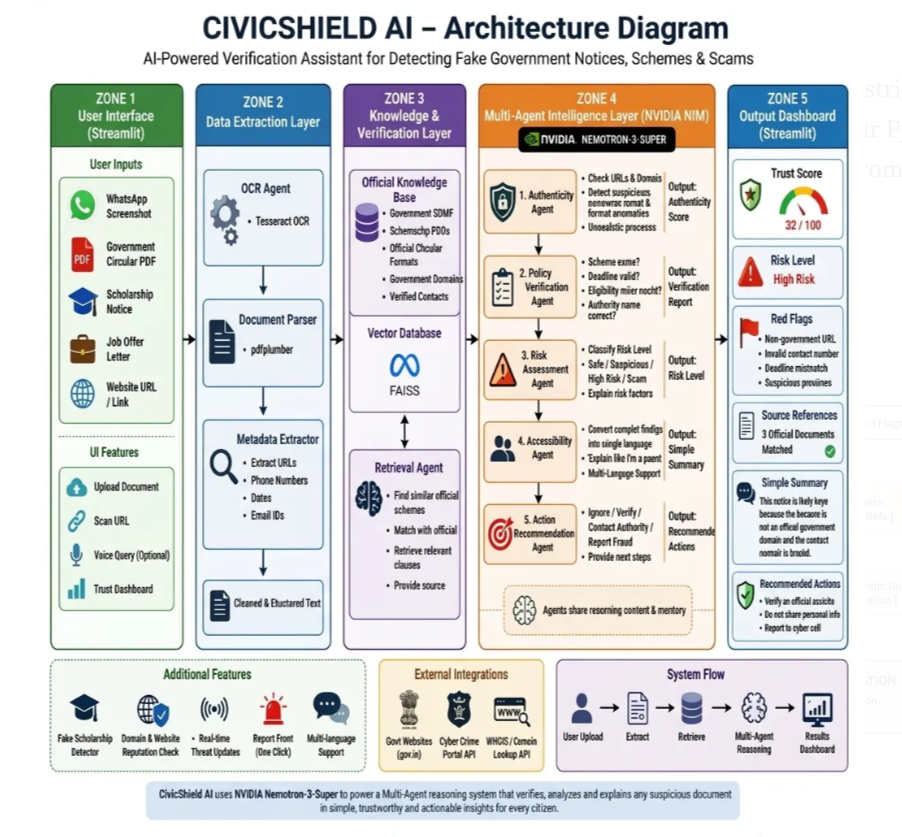

<div align="center">


# 🛡️ CivicShield AI

### *Multi-Agent Scam Detection & Government Document Verification Platform*

[](https://python.org)
[](https://streamlit.io)
[](https://build.nvidia.com)
[](https://github.com/facebookresearch/faiss)
[](LICENSE)

> **Built for the NVIDIA Hackathon** — Empowering citizens to detect government scheme scams, fake circulars, and phishing attempts using a collaborative 5-agent AI pipeline powered by NVIDIA NIM.

</div>

---

## 📋 Table of Contents

- [Overview](#-overview)
- [Key Features](#-key-features)
- [System Architecture](#-system-architecture)
- [5-Agent Pipeline](#-5-agent-collaborative-pipeline)
- [Zone Architecture](#-zone-architecture-breakdown)
- [RAG Knowledge Base](#-rag-knowledge-base)
- [Tech Stack](#-tech-stack)
- [Project Structure](#-project-structure)
- [Setup & Installation](#-setup--installation)
- [Usage](#-usage)
- [How It Works](#-how-it-works-end-to-end-flow)
- [Domain Security Module](#-domain-security-module)

---

## 🌐 Overview

**CivicShield AI** is an advanced multi-agent platform that helps ordinary citizens — especially in rural and semi-urban India — identify and report fake government notices, scam schemes, edited circulars, and phishing links disguised as official communications.

It leverages:
- 🤖 **NVIDIA NIM** (Nemotron / LLaMA-3.1 8B Instruct) for intelligent, structured agentic reasoning
- 🗃️ **FAISS + RAG** for grounded verification against real government documents
- 🌐 **Real-time DNS & Domain Trust Analysis** for live scam URL verification
- 📄 **OCR + PDF Extraction** for analyzing uploaded documents and screenshots

---

## ✨ Key Features

| Feature | Description |
|---|---|
| 🤖 **5-Agent Consensus Pipeline** | Five specialized AI agents collaborate to produce a verified, consensus-based risk assessment |
| 📚 **RAG-Grounded Verification** | FAISS vector search over curated government documents ensures answers are factually grounded |
| 🌐 **Live Domain Security Analysis** | Real-time DNS lookup, TLD risk scoring, WHOIS profiling, and scam keyword detection |
| 📄 **Multi-Format OCR Extraction** | Extracts text from PDFs, JPG, PNG screenshots using pdfplumber and Tesseract OCR |
| 🧬 **Metadata Intelligence** | Automatically extracts URLs, phone numbers, email addresses, and dates for cross-analysis |
| 🟢 **Parent-Friendly Summaries** | Translates complex AI analysis into simple 2-sentence explanations for non-technical users |
| 🎯 **Actionable Steps** | Generates clear next steps: report to cybercrime.gov.in, avoid clicking links, etc. |
| ⚡ **Real-time Reasoning Log** | Live, step-by-step visualization of agent execution in the Streamlit UI |

---

## 🏗️ System Architecture

<div align="center">
  
</div>

```
╔══════════════════════════════════════════════════════════════════════════════╗
║                          CivicShield AI — System Architecture                ║
╠══════════════════════════════════════════════════════════════════════════════╣
║                                                                              ║
║   USER INPUT LAYER                                                           ║
║   ┌─────────────────────┐   ┌──────────────────────────┐                    ║
║   │  📤 File Upload      │   │  📝 Text / URL Input     │                    ║
║   │  (PDF / PNG / JPG)  │   │  (WhatsApp forward text) │                    ║
║   └────────┬────────────┘   └────────────┬─────────────┘                    ║
║            │                             │                                  ║
║            └──────────────┬──────────────┘                                  ║
║                           ▼                                                  ║
║   ┌─────────────────────────────────────────────────────────────────────┐   ║
║   │                     ZONE 2: DATA EXTRACTION                         │   ║
║   │   extractor.py                                                      │   ║
║   │   ┌──────────────┐  ┌──────────────┐  ┌───────────────────────┐    │   ║
║   │   │ pdfplumber   │  │  Tesseract   │  │  Regex Metadata       │    │   ║
║   │   │ PDF→Text     │  │  OCR→Text   │  │  (URLs/Phones/Emails) │    │   ║
║   │   └──────────────┘  └──────────────┘  └───────────────────────┘    │   ║
║   │                      └──────────────────────────────────────┘       │   ║
║   │                               Real-time Domain Verifier             │   ║
║   │                      ┌──────────────────────────────────────┐       │   ║
║   │                      │ DNS Lookup │ TLD Score │ Scam Score  │       │   ║
║   │                      └──────────────────────────────────────┘       │   ║
║   └─────────────────────────────────────────────────────────────────────┘   ║
║                           │                                                  ║
║                           ▼                                                  ║
║   ┌─────────────────────────────────────────────────────────────────────┐   ║
║   │                  ZONE 3: RAG KNOWLEDGE BASE                         │   ║
║   │   rag.py                                                            │   ║
║   │                                                                     │   ║
║   │   knowledge_base/         sentence-transformers          FAISS      │   ║
║   │   ┌─────────────────┐    ┌────────────────────┐    ┌───────────┐   │   ║
║   │   │ pmkisan.txt     │    │ all-MiniLM-L6-v2   │    │ IndexFlat │   │   ║
║   │   │ ayushman.txt    │───▶│ Embed Documents    │───▶│ L2 Search │   │   ║
║   │   │ nsp.txt         │    │ & Query Vectors    │    │ Top-K=3   │   │   ║
║   │   │ ssc_recruit.txt │    └────────────────────┘    └───────────┘   │   ║
║   │   │ domains.txt     │                                               │   ║
║   │   └─────────────────┘                  ▲ Query Vector              │   ║
║   │                                        │                           │   ║
║   └─────────────────────────────────────────│─────────────────────────┘   ║
║                                             │                               ║
║                           ▼                 │                               ║
║   ┌─────────────────────────────────────────────────────────────────────┐   ║
║   │              ZONE 4: NVIDIA NIM — 5-AGENT PIPELINE                  │   ║
║   │   agents.py    ┌─────────────────────────────────────────────────┐  │   ║
║   │                │   NVIDIA NIM API (LLaMA-3.1-8B-Instruct)        │  │   ║
║   │                │   https://integrate.api.nvidia.com/v1            │  │   ║
║   │                └───────────────────────────────────────────────── ┘  │   ║
║   │                                                                     │   ║
║   │  ┌──────────────┐  ┌──────────────┐  ┌──────────────┐             │   ║
║   │  │ 🔍 Agent 1   │  │ 📘 Agent 2   │  │ ⚖️ Agent 3   │             │   ║
║   │  │ Authenticity │─▶│ Policy RAG   │─▶│ Risk Scorer  │             │   ║
║   │  │ URL/Grammar  │  │ Mismatch     │  │ SAFE/HIGH    │             │   ║
║   │  └──────────────┘  └──────────────┘  └──────┬───────┘             │   ║
║   │                                             │                     │   ║
║   │                          ┌──────────────────┴────────────────┐    │   ║
║   │                          ▼                                    ▼    │   ║
║   │                 ┌──────────────┐                  ┌──────────────┐ │   ║
║   │                 │ 🌐 Agent 4   │                  │ 🎯 Agent 5   │ │   ║
║   │                 │ Accessibility│                  │ Action Steps │ │   ║
║   │                 │ Plain-Lang   │                  │ Recommended  │ │   ║
║   │                 └──────────────┘                  └──────────────┘ │   ║
║   └─────────────────────────────────────────────────────────────────────┘   ║
║                           │                                                  ║
║                           ▼                                                  ║
║   ┌─────────────────────────────────────────────────────────────────────┐   ║
║   │                   ZONE 5: STREAMLIT DASHBOARD                       │   ║
║   │   app.py                                                            │   ║
║   │  ┌─────────────┐  ┌─────────────┐  ┌───────────────────────────┐  │   ║
║   │  │ Trust Score │  │ Risk Level  │  │ Red Flags & Source Refs   │  │   ║
║   │  │ 0-100       │  │ SAFE / HIGH │  │ Groundedness Panel        │  │   ║
║   │  └─────────────┘  └─────────────┘  └───────────────────────────┘  │   ║
║   │  ┌──────────────────────────────┐  ┌───────────────────────────┐  │   ║
║   │  │ Parent-Friendly Summary      │  │ Actionable Steps 1-4      │  │   ║
║   │  │ (Plain language)             │  │ (Report / Don't Click)    │  │   ║
║   │  └──────────────────────────────┘  └───────────────────────────┘  │   ║
║   │  ┌─────────────────────────────────────────────────────────────┐  │   ║
║   │  │ 🌐 Live Domain Security Panel (DNS + TLD + Scam Score)      │  │   ║
║   │  └─────────────────────────────────────────────────────────────┘  │   ║
║   └─────────────────────────────────────────────────────────────────────┘   ║
╚══════════════════════════════════════════════════════════════════════════════╝
```

---

## 🤖 5-Agent Collaborative Pipeline

```
Input Text / Extracted Document
         │
         ▼
┌─────────────────────────────────────────────────────────────────────────┐
│                        ORCHESTRATOR (app.py)                            │
│              Chains agents sequentially and visualizes steps             │
└──────────────────────────────────┬──────────────────────────────────────┘
                                   │
         ┌─────────────────────────┼──────────────────────────┐
         ▼                         ▼                          ▼
┌─────────────────┐       ┌─────────────────┐       ┌─────────────────┐
│   AGENT 1 🔍    │       │   AGENT 2 📘    │       │                 │
│   Authenticity  │       │   Policy RAG    │       │                 │
│                 │       │                 │       │                 │
│ • URL domain    │       │ • FAISS search  │       │                 │
│   check (.gov)  │       │   for matching  │       │                 │
│ • Grammar scan  │       │   government    │       │                 │
│ • Score: 0-100  │       │   documents     │       │                 │
│ • Red flags[]   │       │ • Policy match  │       │                 │
└────────┬────────┘       └────────┬────────┘       │                 │
         │                         │                │                 │
         └───────────┬─────────────┘                │                 │
                     ▼                              │                 │
         ┌───────────────────────┐                  │                 │
         │      AGENT 3 ⚖️       │                  │                 │
         │      Risk Agent       │                  │                 │
         │                       │                  │                 │
         │ • Combines scores     │                  │                 │
         │ • Classifies risk:    │                  │                 │
         │   SAFE / SUSPICIOUS   │                  │                 │
         │   HIGH RISK           │                  │                 │
         │ • Merges red flags    │                  │                 │
         └──────────┬────────────┘                  │                 │
                    │                               │                 │
         ┌──────────┴────────────┐                  │                 │
         ▼                       ▼                  │                 │
┌────────────────┐    ┌─────────────────┐           │                 │
│  AGENT 4 🌐   │    │   AGENT 5 🎯    │           │                 │
│  Accessibility │    │  Action Agent   │           └─────────────────┘
│                │    │                 │
│ • Simplifies   │    │ • 3-4 clear     │
│   findings for │    │   next steps    │
│   non-tech     │    │ • e.g. Report   │
│   parents      │    │   to cyber cell │
│ • 2-sentence   │    │ • Do not click  │
│   summary      │    │   links         │
└────────┬───────┘    └────────┬────────┘
         │                     │
         └──────────┬──────────┘
                    ▼
         ┌──────────────────────┐
         │  UNIFIED REPORT JSON  │
         │  trust_score         │
         │  risk_level          │
         │  red_flags[]         │
         │  summary             │
         │  actions[]           │
         │  source_references[] │
         └──────────────────────┘
```

---

## 🗺️ Zone Architecture Breakdown

CivicShield AI is organized into **5 Zones** following a clean data pipeline architecture:

| Zone | File | Role |
|------|------|------|
| **Zone 1** | `app.py` | User Input — File upload or text/URL paste |
| **Zone 2** | `extractor.py` | Data Extraction — PDF, OCR, Metadata, Domain Verification |
| **Zone 3** | `rag.py` | Knowledge Base — FAISS embedding, retrieval, grounding |
| **Zone 4** | `agents.py` | 5-Agent NIM Pipeline — Reasoning, analysis, synthesis |
| **Zone 5** | `app.py` | Output Dashboard — Visualized trust score, flags, actions |

---

## 📚 RAG Knowledge Base

The system maintains a local, offline-capable **FAISS vector knowledge base** from verified government documents:

| Document | Content |
|----------|---------|
| `pmkisan_scheme.txt` | PM-KISAN eligibility, disbursement dates, official portal |
| `ayushman_bharat.txt` | Ayushman Bharat health scheme rules and beneficiary criteria |
| `nsp_scholarship.txt` | National Scholarship Portal deadlines and eligibility |
| `ssc_recruitment.txt` | SSC recruitment rules, official notification domains |
| `official_domains.txt` | Verified `.gov.in` and `.nic.in` domain whitelist |

**How it works:**
```
Document .txt files
       │
       ▼
 Sliding Window Chunking (300 words, 50-word overlap)
       │
       ▼
 Sentence Embedding (all-MiniLM-L6-v2)
       │
       ▼
 FAISS IndexFlatL2 Vector Store
       │
       ▼  ← Query text at runtime
 Top-K=3 Chunk Retrieval (L2 distance < 3.0)
       │
       ▼
 Context passed to Policy Agent (Agent 2)
```

---

## 🛠️ Tech Stack

| Layer | Technology | Purpose |
|-------|-----------|---------|
| **Frontend** | Streamlit 1.32+ | Interactive web dashboard |
| **AI Backbone** | NVIDIA NIM (LLaMA-3.1-8B-Instruct) | Multi-agent LLM reasoning |
| **Vector DB** | FAISS (CPU) | Local semantic vector search |
| **Embeddings** | sentence-transformers (all-MiniLM-L6-v2) | Text embedding model |
| **PDF Parsing** | pdfplumber | PDF text extraction |
| **OCR** | Tesseract + pytesseract | Image/screenshot text extraction |
| **Domain Security** | socket (DNS) + regex | Real-time domain trust scoring |
| **Env Config** | python-dotenv | Secure API key management |
| **LLM Client** | openai (Python SDK) | NIM API communication |

---

## 📁 Project Structure

```
NVIDIA Projects/
│
├── 📄 app.py                  # Zone 1 + 5: Streamlit UI, orchestration
├── 🤖 agents.py               # Zone 4: 5 NIM-powered AI agents
├── 🗃️ rag.py                  # Zone 3: FAISS RAG engine
├── 🔍 extractor.py            # Zone 2: PDF, OCR, metadata, domain analysis
│
├── 📚 knowledge_base/
│   ├── pmkisan_scheme.txt     # PM-KISAN official info
│   ├── ayushman_bharat.txt    # Ayushman Bharat scheme
│   ├── nsp_scholarship.txt    # National Scholarship Portal
│   ├── ssc_recruitment.txt    # SSC recruitment notices
│   ├── official_domains.txt   # Verified .gov.in domains
│   └── rag_cache.pkl          # Auto-generated FAISS index cache
│
├── 📦 requirements.txt        # Python dependencies
├── 🔐 .env                    # Local API key (NOT committed to Git)
├── 📋 .env.example            # Template for API key setup
├── 🚫 .gitignore              # Prevents secrets from leaking to GitHub
└── 📖 README.md               # This file
```

---

## ⚙️ Setup & Installation

### Prerequisites

| Requirement | Version |
|------------|---------|
| Python | 3.11+ |
| Tesseract OCR | 5.x (Windows installer below) |
| NVIDIA NIM API Key | Free from [build.nvidia.com](https://build.nvidia.com/) |

### Step 1 — Clone the repository

```bash
git clone https://github.com/YOUR_USERNAME/civicshield-ai.git
cd civicshield-ai
```

### Step 2 — Install Python dependencies

```bash
pip install -r requirements.txt
```

### Step 3 — Install Tesseract OCR (Windows)

Download and install from:
👉 [https://github.com/UB-Mannheim/tesseract/wiki](https://github.com/UB-Mannheim/tesseract/wiki)

If Tesseract is not in your PATH, add this to `extractor.py`:
```python
pytesseract.pytesseract.tesseract_cmd = r"C:\Program Files\Tesseract-OCR\tesseract.exe"
```

### Step 4 — Configure your API Key

```bash
# Copy the example env file
copy .env.example .env
```

Edit `.env` and paste your NVIDIA NIM API Key:
```env
NVIDIA_API_KEY=nvapi-your-key-here
```

> ⚠️ **NEVER commit your `.env` file to GitHub.** It is already listed in `.gitignore`.

### Step 5 — Run the application

```bash
streamlit run app.py
```

Open your browser at `http://localhost:8501` 🎉

---

## 🚀 Usage

1. **Launch the app** with `streamlit run app.py`
2. **Upload a document** (PDF / PNG / JPG of a WhatsApp forward or notice) **OR paste text/URL** directly
3. Click **"🔍 Analyze Authenticity"**
4. Watch the **5-agent reasoning log** execute in real time
5. Review the **trust score**, **risk level**, **red flags**, **domain analysis**, and **recommended actions**

### Example Test Cases

| Input | Expected Result |
|-------|----------------|
| `https://pm-kisan-free-money.xyz/apply` | 🚨 HIGH RISK — Fake domain, scam keywords |
| `https://pmkisan.gov.in/apply` | ✅ SAFE — Verified .gov.in domain |
| `"URGENT: Free laptop at pm-laptop-2024.xyz"` | 🚨 HIGH RISK — Urgency + fake TLD |
| `"Your PM-KISAN installment of ₹2000 has been credited"` | ✅ SAFE — Status update, no policy claims |

---

## 🔄 How It Works: End-to-End Flow

```
User submits document/text
        │
        ▼
[extractor.py] Extract text via PDF/OCR
        │
        ├─▶ extract_metadata() ─▶ URLs, phones, emails, dates
        └─▶ verify_domain()    ─▶ DNS, TLD score, scam score
        │
        ▼
[rag.py] retrieve_context()
   └─▶ FAISS search over knowledge_base/
        Returns: top 3 matching chunks + source names
        │
        ▼
[agents.py] Agentic Pipeline
   ├─ authenticity_agent()  ─▶ {score, red_flags}
   ├─ policy_agent()        ─▶ {policy_mismatch, red_flags, source_refs}
   ├─ risk_agent()          ─▶ {risk_level, total_score, all_red_flags}
   ├─ accessibility_agent() ─▶ {parent_friendly_summary}
   └─ action_agent()        ─▶ {recommended_actions}
        │
        ▼
[app.py] Render Dashboard
   ├─ Trust Score Metric
   ├─ Risk Level Badge (SAFE / SUSPICIOUS / HIGH RISK)
   ├─ 🌐 Domain Security Panel (per URL)
   ├─ 🚩 Red Flags List
   ├─ 📚 Source References (Groundedness)
   ├─ 👨‍👩‍👧 Parent-Friendly Summary
   └─ 🎯 Recommended Actions
```

---

## 🌐 Domain Security Module

The `verify_domain()` function in `extractor.py` performs **real-time security analysis** for every URL found in the submitted document:

```
Domain Input (e.g. pm-kisan-free.xyz)
        │
        ▼
1. DNS Resolution ─▶ socket.gethostbyname()
        │
        ▼
2. TLD Risk Classification
   ├─ .gov.in / .nic.in  ─▶ SECURE GOVT DOMAIN ✅
   ├─ .xyz / .tk / .ml   ─▶ HIGH RISK TLD ⚠️
   └─ Others             ─▶ NEUTRAL
        │
        ▼
3. Scam Keyword Detection
   └─ Keywords: kisan, free, scheme, pm, yojana, aadhar, cash...
        │
        ▼
4. Scam Score Calculation (0–100)
   ├─ +40 for government keywords on non-gov domain
   ├─ +35 for high-risk TLD
   └─ +15 for unresolved DNS
        │
        ▼
5. Trust Label Assignment
   ├─ Score  0   → SECURE GOVT DOMAIN 🟢
   ├─ Score ≥40  → SUSPICIOUS DOMAIN 🟡
   └─ Score ≥70  → CRITICAL SCAM RISK 🔴
```

---

## 📜 License

This project is licensed under the **MIT License** — see the [LICENSE](LICENSE) file for details.

---

<div align="center">

**Built with ❤️ for India's 1.4 Billion Citizens**

*Powered by NVIDIA NIM | CivicShield AI v1.0 — Hackathon Edition*

</div>
